# YelpReviewGym

[](https://github.com/ankitlade12/YelpReviewGym/actions/workflows/tests.yml)
[](https://www.python.org/downloads/)
[](https://github.com/psf/black)
[](https://opensource.org/licenses/MIT)

Turn your **Yelp reviews** into interactive customer-service training for your team.

**Live Demo:** https://yelpreviewgym.streamlit.app/

## ⚡ Quick Highlights

- 🤖 **AI-Powered**: Uses Yelp AI API for review analysis, scenario generation, and feedback
- **Automated Training**: Converts real customer pain points into practice scenarios
- **Progress Tracking**: Leaderboards, badges, and performance analytics
- **Production Ready**: 48 unit tests, performance monitoring, deployed live
- **Fast Setup**: Install and run in under 5 minutes

## Architecture Overview

### High-Level Workflow


### System Architecture

```mermaid
graph TB
    UI["🖥️ USER INTERFACE<br/>Streamlit | Analyze, Generate, Practice<br/>Dashboard, Leaderboard, Profile"]
    APP["⚙️ APPLICATION<br/>run_app_enhanced.py<br/>Session State | UI Rendering"]
    SVC["🔧 SERVICE LAYER<br/>yelp_ai_client | insights_service<br/>enhanced_features"]
    DATA["💾 DATA LAYER<br/>schemas.py | config.py<br/>JSON Storage"]
    EXT["🤖 YELP AI API<br/>Review Analysis | NLG<br/>Response Evaluation"]

    UI --> APP --> SVC
    SVC --> DATA
    SVC --> EXT

    style UI fill:#e1f5ff,stroke:#0288d1,stroke-width:2px
    style APP fill:#fff4e1,stroke:#f57c00,stroke-width:2px
    style SVC fill:#e8f5e9,stroke:#388e3c,stroke-width:2px
    style DATA fill:#f3e5f5,stroke:#7b1fa2,stroke-width:2px
    style EXT fill:#ffe0b2,stroke:#e64a19,stroke-width:2px
```



### Tech Stack

| Layer | Technology | Purpose |
|-------|-----------|---------|
| **Frontend** | Streamlit 1.37+ | Web UI framework |
| **Backend** | Python 3.11 | Application logic |
| **AI Engine** | Yelp AI Chat API | NLU & NLG |
| **Validation** | Pydantic 2.8+ | Data validation |
| **Storage** | JSON Files | Persistence |
| **Deployment** | Streamlit Cloud | Hosting |

## What is YelpReviewGym?

YelpReviewGym uses **Yelp AI** to analyze your business's Yelp reviews and automatically create:

1. **Insights** - What customers love (delights), what they complain about (pains), and customer personas
2. **Training Scenarios** - Real-world customer service situations based on actual pain points
3. **Interactive Practice** - Staff can practice responses and get AI-powered feedback

## Features

### Core Features
- **Automatic Review Analysis** - Extracts patterns from your Yelp reviews
- **Scenario Generation** - Creates bad vs. good dialogue examples for each pain point
- **AI Feedback** - Scores staff responses (0-10) with strengths & improvements
- **Powered by Yelp AI** - Uses real business data from Yelp

### Professional Edition Features
- **Progress Tracking** - Save and track all training sessions with JSON persistence
- **Leaderboard System** - Team rankings, competition, and top performer tracking
- **Badges & Achievements** - Gamification with "First Steps", "Practice Makes Perfect", "Master Trainer", "High Achiever", "Perfect Score"
- **Analytics Dashboard** - Score trends, improvement tracking, and visual charts
- **Certification System** - Bronze/Silver/Gold certificates based on performance
- **Training Reports** - Comprehensive session reports with downloadable exports
- **User Profiles** - Individual performance tracking and personalized stats
- **Difficulty Levels** - Easy/Medium/Hard scenarios with smart categorization
- **Multi-tab Interface** - Organized tabs for Training, Analytics, Leaderboard, and Reports
- **Session Tracking** - Monitor time spent and scenarios practiced per session

## Quick Start

### Prerequisites

- Python 3.11+
- Yelp API Key (get one from [Yelp Developers](https://www.yelp.com/developers))

### Installation

```bash
# Clone and navigate to project
cd CareRoute

# Install dependencies with uv (recommended)
uv sync

# Set your Yelp API key in .env file
echo "YELP_API_KEY=your_yelp_api_key_here" > .env

# Option 1: Use interactive launcher (choose standard or enhanced)
chmod +x launch.sh
./launch.sh

# Option 2: Run enhanced version directly (RECOMMENDED)
uv run streamlit run run_app_enhanced.py

# Option 3: Run standard version
uv run streamlit run run_app.py
```

Or with pip:

```bash
pip install streamlit requests pydantic pydantic-settings
export YELP_API_KEY="your_yelp_api_key_here"
streamlit run run_app_enhanced.py
```

### Usage

#### Standard Version (run_app.py)
1. **Enter Business Details** - Business name, location, and type
2. **Analyze Reviews** - Click "Analyze Business" to extract insights
3. **Generate Scenarios** - Click "Generate Scenarios" for practice situations
4. **Practice & Get Feedback** - Select a scenario, respond, get AI feedback

#### Enhanced Version (run_app_enhanced.py) - RECOMMENDED
1. **Set User Profile** - Enter your name in the sidebar
2. **Analyze Business** - Same as standard version
3. **Generate & Practice** - Same workflow with added difficulty levels
4. **Track Progress** - View your stats, badges, and trends in real-time
5. **Check Leaderboard** - See team rankings and top performers
6. **View Analytics** - Explore score trends and improvement charts
7. **Generate Reports** - Download comprehensive training session reports
8. **Earn Certification** - Achieve Bronze/Silver/Gold certification levels

## How It Works

### Step 1: Review Analysis
```
Business → Yelp AI → Extract Delights/Pains/Personas
```

Example output:
- **Delights**: "Customers love the cozy atmosphere and friendly staff"
- **Pains**: "Long wait times during lunch rush"
- **Personas**: "Busy weekday lunch customers expecting quick service"

### Step 2: Scenario Generation
```
Pains → Yelp AI → Training Scenarios (bad vs good dialogue)
```

Example scenario:
- **Title**: "Handling delayed orders at lunch rush"
- **Bad Example**: Staff makes excuses without empathy
- **Good Example**: Staff apologizes, explains, offers compensation

### Step 3: Practice & Feedback
```
Staff Response → Yelp AI → Score + Strengths + Improvements
```

Example feedback:
- **Score**: 8/10
- **Strengths**: "Good empathy, clear explanation"
- **Improvements**: "Could offer a specific compensation option"

## Example Businesses to Try

1. **Café** - "Calm Corner Café, Dallas, TX"
2. **Restaurant** - "Local Italian Restaurant, San Francisco, CA"
3. **Retail Store** - "Downtown Bookstore, Austin, TX"

## Architecture

### Standard Version (run_app.py)
- **Streamlit UI** - Clean 3-column layout for workflow
- **Yelp AI integration** - Uses Yelp's `/ai/chat/v2` endpoint
- **Modular services** - Separated concerns in `src/yelpreviewgym/`
- **State management** - Streamlit session state for insights/scenarios/feedback

### Enhanced Version (run_app_enhanced.py)
All of the above PLUS:
- **Progress Tracking** - JSON file persistence (`training_progress.json`)
- **Leaderboard** - Multi-user tracking (`leaderboard.json`)
- **Enhanced Features Module** - `enhanced_features.py` with 5 core classes:
  - `ProgressTracker` - Session history and badge management
  - `LeaderboardManager` - User rankings and stats
  - `CertificationSystem` - Achievement levels and certificates
  - `ReportGenerator` - Comprehensive report creation
  - Utility functions for difficulty and badges

### Project Structure
```
YelpReviewGym/
├── run_app.py                          # Standard version
├── run_app_enhanced.py                 # Enhanced version (recommended)
├── launch.sh                           # Interactive launcher
├── src/yelpreviewgym/
│   ├── config.py                      # Settings & environment
│   ├── schemas.py                     # Data models
│   ├── yelp_ai_client.py             # Yelp API client
│   ├── insights_service.py           # Core AI logic
│   └── enhanced_features.py          # Progress, badges, reports
├── training_progress.json             # Generated: User progress
├── leaderboard.json                   # Generated: Team rankings
└── .env                               # Your YELP_API_KEY
```

## API Key Setup

Get your Yelp API key:

1. Go to https://www.yelp.com/developers
2. Create an account or log in
3. Create a new app
4. Copy your API key

Set it in your environment:

```bash
# Temporary (current terminal session)
export YELP_API_KEY="your_key_here"

# Permanent (add to ~/.zshrc or ~/.bashrc)
echo 'export YELP_API_KEY="your_key_here"' >> ~/.zshrc
source ~/.zshrc
```

## Troubleshooting

**Error: "YELP_API_KEY is not set"**
- Make sure you've exported the environment variable
- Restart your terminal after setting it

**Error: "Yelp AI API error 401"**
- Your API key is invalid or expired
- Get a new key from Yelp Developers

**"No valid JSON returned"**
- Yelp AI sometimes returns text instead of JSON
- Click the debug expander to see raw response
- Try again with more specific business name/location

## Versions Comparison

| Feature | Standard (run_app.py) | Enhanced (run_app_enhanced.py) |
|---------|----------------------|--------------------------------|
| Review Analysis | Yes | Yes |
| Scenario Generation | Yes | Yes |
| AI Feedback | Yes | Yes |
| Progress Tracking | No | Yes |
| Leaderboard | No | Yes |
| Badges & Gamification | No | Yes |
| Analytics Dashboard | No | Yes |
| Certification System | No | Yes |
| Training Reports | No | Yes |
| User Profiles | No | Yes |
| Difficulty Levels | No | Yes |
| Multi-tab Interface | No | Yes |
| Session Tracking | No | Yes |

**Recommendation:** Use **run_app_enhanced.py** for production - it's production-ready with enterprise features!

## Future Enhancements

### Completed
- [x] Team leaderboard with scores
- [x] Export scenarios to PDF/Text
- [x] Progress tracking and analytics
- [x] Gamification with badges
- [x] Certification system
- [x] Multi-level difficulty

### Planned
- [ ] Multi-language support
- [ ] Integration with LMS platforms
- [ ] Voice practice mode
- [ ] Video scenario examples
- [ ] Mobile app version
- [ ] API for third-party integrations

## Credits

Built with:
- [Yelp AI](https://www.yelp.com/developers) - Business data and AI analysis
- [Streamlit](https://streamlit.io/) - Web interface
- [Python](https://python.org/) - Backend logic
