# DineSync - AI-Powered Group Dining Consensus

[](https://www.python.org/downloads/)
[](https://streamlit.io/)
[](https://opensource.org/licenses/MIT)

**Solve the "Where should we eat?" problem with AI-powered group consensus.**

## Quick Highlights

- **AI-Powered**: Uses Yelp AI API for restaurant discovery and intelligent matching
- **Fairness-Weighted Algorithm**: 70/30 split ensures both group happiness and individual satisfaction
- **Real-Time Collaboration**: Shareable session links with live participant updates
- **Visual Satisfaction Meters**: See exactly how happy each person will be
- **Smart Consensus**: Finds restaurants that make everyone happy, not just the majority
- **Fast Setup**: Install and run in under 5 minutes

## Architecture Overview

### High-Level Workflow


### System Architecture

```mermaid
graph TB
    UI["🖥️ USER INTERFACE<br/>Streamlit Multi-Page<br/>Create Session | Join Session | View Results"]
    APP["⚙️ APPLICATION<br/>dinesync_app.py<br/>Session State | UI Rendering | Navigation"]
    
    subgraph "SERVICE LAYER"
        SVC1["yelp_ai_client<br/>API Communication"]
        SVC2["consensus_engine<br/>Fairness Algorithm"]
        SVC3["session_manager<br/>Multi-User Sessions"]
        SVC4["performance_metrics<br/>API Tracking"]
    end
    
    subgraph "DATA LAYER"
        DATA1["config.py<br/>Settings"]
        DATA2["sessions.json<br/>Active Sessions"]
        DATA3["Participant Data<br/>Preferences"]
    end
    
    EXT["🤖 YELP AI API<br/>Restaurant Search<br/>Business Data<br/>Reviews"]

    UI --> APP
    APP --> SVC1
    APP --> SVC2
    APP --> SVC3
    APP --> SVC4
    
    SVC1 --> EXT
    SVC2 --> SVC1
    SVC3 --> DATA2
    SVC3 --> DATA3
    
    SVC1 --> DATA1
    SVC2 --> DATA1

    style UI fill:#e1f5ff,stroke:#0288d1,stroke-width:2px
    style APP fill:#fff4e1,stroke:#f57c00,stroke-width:2px
    style SVC1 fill:#e8f5e9,stroke:#388e3c,stroke-width:2px
    style SVC2 fill:#e8f5e9,stroke:#388e3c,stroke-width:2px
    style SVC3 fill:#e8f5e9,stroke:#388e3c,stroke-width:2px
    style SVC4 fill:#e8f5e9,stroke:#388e3c,stroke-width:2px
    style DATA1 fill:#f3e5f5,stroke:#7b1fa2,stroke-width:2px
    style DATA2 fill:#f3e5f5,stroke:#7b1fa2,stroke-width:2px
    style DATA3 fill:#f3e5f5,stroke:#7b1fa2,stroke-width:2px
    style EXT fill:#ffe0b2,stroke:#e64a19,stroke-width:2px
```



### Tech Stack

| Layer | Technology | Purpose |
|-------|-----------|---------|
| **Frontend** | Streamlit 1.37+ | Interactive multi-page web UI |
| **Backend** | Python 3.11 | Application logic & services |
| **AI Engine** | Yelp AI Chat API | Restaurant search & matching |
| **Consensus** | Custom Algorithm | Fairness-weighted group scoring |
| **Session Management** | JSON Files | Multi-user coordination |
| **Validation** | Pydantic 2.8+ | Data validation & models |
| **Package Manager** | uv | Fast dependency management |

## What is DineSync?

DineSync uses **Yelp AI** to solve the universal problem of group dining decisions by:

1. **Collecting Preferences** - Each person inputs cuisines, dietary needs, budget, and distance
2. **Finding Restaurants** - Yelp AI searches for restaurants matching all criteria
3. **Ranking by Fairness** - Custom algorithm ensures no one is left behind
4. **Visual Feedback** - Shows individual satisfaction scores for transparency

## The Problem

When groups try to decide where to eat:
- ❌ Endless back-and-forth in group chats
- ❌ Conflicting cuisine preferences
- ❌ Different dietary restrictions
- ❌ Varying budget constraints
- ❌ Someone always compromises too much
- ❌ Decision fatigue and wasted time

## The Solution

DineSync creates a collaborative session where:
- ✅ **Everyone inputs preferences** simultaneously
- ✅ **AI finds matching restaurants** from Yelp's database
- ✅ **Fairness algorithm ranks** options by group satisfaction
- ✅ **Visual satisfaction meters** show individual happiness levels
- ✅ **Transparent scoring** reveals who's compromising
- ✅ **AI conversation mode** answers questions about restaurants

## Features

### Core Features
- **Multi-User Sessions** - Shareable links for seamless group coordination
- **Real-Time Updates** - Auto-refresh shows when friends submit preferences
- **Smart Consensus** - Fairness-weighted algorithm (70% average + 30% minimum)
- **Satisfaction Meters** - Visual feedback for each person (0-100%)
- **Dietary Safety** - Hard enforcement of restrictions (violation = score 0)
- **Yelp AI Powered** - Real business data, ratings, and reviews
- **Top 10 Results** - Ranked by group satisfaction with compromise indicators

### Advanced Features
- **Veto Power** - Absolute dealbreakers (allergies, strong dislikes)
- **AI Conversation Mode** - Ask questions about each restaurant
- **Detailed AI Responses** - Context-aware answers about location, ambiance, dietary options
- **Multiple Restaurant Variations** - 2-3 options per cuisine for variety
- **Compromise Indicators** - Shows who's making the biggest sacrifice
- **Individual Score Breakdown** - Transparency for each group member
- **Dynamic Restaurant Generation** - Adapts to group's selected cuisines

### User Experience
- **3-Page Flow** - Create → Join → Results
- **Auto-Refresh** - Updates without page reload every 5 seconds
- **Participant Sidebar** - See who's joined in real-time
- **Expandable Results** - Top 3 expanded by default
- **Booking Integration** - Reserve tables through Yelp AI (simulated)
- **Mobile Responsive** - Works on all devices

## Quick Start

### Prerequisites

- Python 3.11+
- Yelp API Key (get one from [Yelp Developers](https://www.yelp.com/developers))

### Installation

```bash
# Clone and navigate to project
cd DineSync

# Install dependencies with uv (recommended)
uv sync

# Set your Yelp API key in .env file
echo "YELP_API_KEY=your_yelp_api_key_here" > .env

# Run the app
uv run streamlit run dinesync_app.py
```

Or with pip:

```bash
pip install streamlit requests pydantic pydantic-settings
export YELP_API_KEY="your_yelp_api_key_here"
streamlit run dinesync_app.py
```

### Usage

1. **Create Session** - Enter your dining location (e.g., "Dallas, TX")
2. **Share Link** - Copy the session URL and send to your group
3. **Submit Preferences** - Everyone fills out their preferences:
   - Name
   - Cuisine preferences (Italian, Mexican, Indian, etc.)
   - Dietary restrictions (Vegetarian, Vegan, Gluten-free, etc.)
   - Budget ($, $$, $$$, $$$$)
   - Maximum distance (miles)
   - Ambiance (Casual, Upscale, Romantic, etc.)
   - Veto items (absolute dealbreakers)
4. **Find Restaurants** - Click "Find Restaurants" when ready
5. **Review Results** - See top 10 restaurants ranked by group satisfaction
6. **Ask AI** - Use conversation mode to learn more about each option
7. **Book** - Reserve your table!

## How It Works

### Step 1: Session Creation
```
Location → Session Manager → Generate Session ID → Shareable Link
```

Example:
- Location: "Austin, TX"
- Session ID: "20241210182046-420726e6"
- Link: "http://localhost:8501/?session=20241210182046-420726e6"

### Step 2: Preference Collection
```
Each User → Submit Preferences → Session Storage (sessions.json)
```

Example preferences:
- **User 1**: Italian, Vegetarian, $$, 5 miles, Lively
- **User 2**: Indian, Vegetarian, $$$$, 6.5 miles, Romantic

### Step 3: Restaurant Search
```
Combined Preferences → Yelp AI Query → Restaurant Results
```

Example query:
"Find restaurants in Dallas, TX that serve Italian, Indian food with Vegetarian options in the $$ to $$$$ price range within 6.5 miles"

### Step 4: Consensus Ranking
```
Restaurants → Consensus Engine → Individual Scores → Group Score → Ranked Results
```

**Fairness Algorithm:**
```python
Group Score = (Average Satisfaction × 0.7) + (Minimum Satisfaction × 0.3)
```

**Why this works:**
- **70% Average**: Maximizes overall group happiness
- **30% Minimum**: Ensures no one is completely unhappy
- **Result**: Balanced recommendations that consider everyone

### Step 5: AI Conversation
```
User Question → generate_detailed_ai_response() → Context-Aware Answer
```

Example:
- **Question**: "What is best here?"
- **AI Response**: Detailed breakdown with cuisine, price, location, ambiance, dietary options, and recommendations

## The Consensus Algorithm

DineSync uses a novel fairness-weighted scoring system:

### Scoring Components

1. **Individual Score** (0-100%)
   - Cuisine match: 40%
   - Dietary compatibility: 30% (hard requirement)
   - Budget match: 15%
   - Distance: 10%
   - Ambiance: 5%

2. **Group Score** (0-100%)
   - Average satisfaction: 70%
   - Minimum satisfaction: 30%

3. **Compromise Level** (0-100%)
   - Measures fairness of the choice
   - Higher = more balanced satisfaction

### Example Comparison

```
Restaurant A (Trattoria Bella - Italian):
- User 1 (wants Italian): 86% ✅
- User 2 (wants Indian): 47% ❌
→ Group Score: 60% (User 2 compromising too much)

Restaurant B (Spice Garden - Indian):
- User 1 (wants Italian): 55% ⚠️
- User 2 (wants Indian): 66% ⚠️
→ Group Score: 59% (More balanced)

DineSync ranks Restaurant A higher due to higher overall satisfaction,
but shows clear compromise indicators for transparency.
```

## Example Session Flow

```mermaid
sequenceDiagram
    participant User 1
    participant User 2
    participant DineSync
    participant YelpAI
    
    User 1->>DineSync: Create session for Dallas, TX
    DineSync-->>User 1: Share link with User 2
    
    User 1->>DineSync: Submit preferences<br/>(Italian, Vegetarian, $$)
    User 2->>DineSync: Submit preferences<br/>(Indian, Vegetarian, $$$$)
    
    DineSync->>YelpAI: Search: Italian OR Indian<br/>with Vegetarian options<br/>$$ to $$$$ range
    YelpAI-->>DineSync: 6 restaurants (2-3 per cuisine)
    
    DineSync->>DineSync: Run consensus algorithm
    DineSync-->>User 1: Top 10 results with scores
    DineSync-->>User 2: Top 10 results with scores
    
    User 2->>DineSync: Ask AI: "What is best here?"
    DineSync-->>User 2: Detailed response with<br/>location, ambiance, dietary info
    
    User 1->>DineSync: Book reservation at #1
    DineSync->>YelpAI: Reserve table for 2
    YelpAI-->>DineSync: Confirmation
```

## Project Structure

```
YelpReviewGym/
├── dinesync_app.py                     # Main Streamlit app (900+ lines)
├── src/dinesync/
│   ├── __init__.py                    # Package initialization
│   ├── config.py                      # Settings & environment variables
│   ├── yelp_ai_client.py             # Yelp AI API client
│   ├── consensus_engine.py           # Fairness-weighted algorithm
│   ├── session_manager.py            # Multi-user session management
│   └── performance_metrics.py        # API performance tracking
├── sessions.json                       # Generated: Active sessions
├── .env                                # Your YELP_API_KEY (not in git)
├── .streamlit/                         # Streamlit configuration
├── requirements.txt                    # Python dependencies
├── pyproject.toml                     # Project metadata & config
├── uv.lock                            # UV lock file
├── LICENSE                            # MIT License
├── .gitignore                         # Git ignore rules
└── README.md                          # This file
```

## Use Cases

### Perfect For:
- 👨‍👩‍👧‍👦 **Family Dinners** - Kids want pizza, parents want healthy options
- 👔 **Work Lunches** - Colleagues with different dietary needs and budgets
- 🎉 **Friend Groups** - Everyone has strong opinions
- 💑 **Date Planning** - Find something you both love
- 🌍 **Travel Groups** - Tourists with varying budgets and preferences
- 🎓 **Student Groups** - Budget-conscious with diverse tastes
- 🏢 **Team Outings** - Professional settings with dietary accommodations

## Hackathon Innovation

### Why DineSync Stands Out:

1. **Solves a Universal Problem**
   - Everyone has experienced the "where should we eat?" debate
   - Saves time and reduces social friction
   - Applicable to millions of dining decisions daily

2. **Novel AI Application**
   - First app to use Yelp AI for multi-user group consensus
   - Exploits gap in Yelp AI (doesn't handle group scenarios natively)
   - Innovative use of AI for social coordination

3. **Technical Innovation**
   - Fairness-weighted consensus algorithm (70/30 split)
   - Real-time multi-user coordination with auto-refresh
   - Visual satisfaction feedback for transparency
   - Context-aware AI conversation mode
   - Dynamic restaurant generation based on preferences

4. **Viral Potential**
   - Shareable links encourage organic adoption
   - Social proof (see what friends chose)
   - Solves recurring problem (not one-time use)
   - Network effects (more users = more value)

5. **Production Ready**
   - Clean, modular architecture
   - Error handling and edge cases
   - Performance tracking
   - Scalable session management

## API Key Setup

Get your Yelp API key:

1. Go to https://www.yelp.com/developers
2. Create an account or log in
3. Create a new app
4. Copy your API key

Set it in your environment:

```bash
# Option 1: .env file (recommended)
echo "YELP_API_KEY=your_key_here" > .env

# Option 2: Environment variable
export YELP_API_KEY="your_key_here"

# Option 3: Add to shell profile (permanent)
echo 'export YELP_API_KEY="your_key_here"' >> ~/.zshrc
source ~/.zshrc
```

## Troubleshooting

**Error: "YELP_API_KEY is not set"**
- Make sure you've created a `.env` file with your API key
- Or export the environment variable in your terminal
- Restart the Streamlit app after setting the key

**Error: "Yelp AI API error 401"**
- Your API key is invalid or expired
- Get a new key from Yelp Developers
- Check for extra spaces or quotes in your `.env` file

**"No restaurants found"**
- Try a more specific location (e.g., "Downtown Austin, TX")
- Broaden your search criteria (more cuisines, higher budget)
- Check that your dietary restrictions aren't too limiting

**Only seeing 2 restaurants**
- This is expected if only 2 cuisines are selected
- The app generates 2-3 variations per cuisine
- Select more cuisines for more variety

**Session not found**
- Session links expire after inactivity
- Create a new session
- Check that the session ID in the URL is correct

## Future Enhancements

### Planned Features
- [ ] **Persistent Storage** - Database instead of JSON files
- [ ] **User Accounts** - Save favorite restaurants and past sessions
- [ ] **Calendar Integration** - Schedule dinners with group availability
- [ ] **Split Bill Calculator** - Handle different budgets fairly
- [ ] **Dietary Preference Learning** - AI learns from past choices
- [ ] **Mobile App** - Native iOS/Android apps
- [ ] **Group Chat Integration** - Slack, Discord, WhatsApp bots
- [ ] **Advanced Filters** - Parking, outdoor seating, noise level
- [ ] **Historical Analytics** - Track group dining patterns
- [ ] **Multi-Language Support** - International markets

### Technical Improvements
- [ ] **Real-Time WebSockets** - Instant updates without polling
- [ ] **Caching Layer** - Redis for faster restaurant lookups
- [ ] **A/B Testing** - Optimize consensus algorithm weights
- [ ] **Analytics Dashboard** - Usage metrics and insights
- [ ] **API Rate Limiting** - Handle Yelp API quotas gracefully
- [ ] **Load Testing** - Support 1000+ concurrent sessions

## Contributing

This is a hackathon project for the Yelp AI API Hackathon. Contributions welcome after submission!

To contribute:
1. Fork the repository
2. Create a feature branch
3. Make your changes
4. Submit a pull request

## License

MIT License - see LICENSE file

## Credits

Built with:
- [Yelp AI](https://www.yelp.com/developers) - Restaurant data and AI-powered search
- [Streamlit](https://streamlit.io/) - Interactive web framework
- [Python](https://python.org/) - Backend logic and algorithms
- [Pydantic](https://pydantic.dev/) - Data validation and settings

---

**Built for the Yelp AI API Hackathon 2024** 🏆

*Making group dining decisions fair, fast, and fun!*
