# YelpReviewGym

[](https://github.com/ankitlade12/YelpReviewGym/actions/workflows/tests.yml)
[](https://www.python.org/downloads/)
[](https://github.com/psf/black)
[](https://opensource.org/licenses/MIT)

Turn your **Yelp reviews** into interactive customer-service training for your team.

**Live Demo:** https://yelpreviewgym.streamlit.app/

## Quick Highlights

- **AI-Powered**: Uses Yelp AI API for review analysis, scenario generation, and feedback
- **User Management**: Persistent profiles, progress tracking, and session recovery
- **Certification System**: Performance-based certificates for scores ≥ 8.0/10
- **Competitive Features**: Global and business-specific leaderboards with smart filtering
- **Production Ready**: 113 unit tests, performance monitoring, deployed live
- **Fast Setup**: Install and run in under 5 minutes

## Architecture Overview

### High-Level Workflow


### System Architecture

```mermaid
graph TB
    UI["🖥️ USER INTERFACE<br/>Streamlit Multi-Tab<br/>Training | Analytics | Leaderboard | Reports"]
    APP["⚙️ APPLICATION<br/>run_app_enhanced.py<br/>Session State | UI Rendering | Navigation"]
    
    subgraph "SERVICE LAYER"
        SVC1["yelp_ai_client<br/>API Communication"]
        SVC2["insights_service<br/>Analysis & Scenarios"]
        SVC3["user_manager<br/>Profile & Progress"]
        SVC4["performance_metrics<br/>Tracking & Stats"]
    end
    
    subgraph "DATA LAYER"
        DATA1["schemas.py<br/>Pydantic Models"]
        DATA2["config.py<br/>Settings"]
        DATA3["user_data.json<br/>Persistent Storage"]
        DATA4["performance_metrics.json<br/>Performance Logs"]
    end
    
    EXT["🤖 YELP AI API<br/>Review Analysis<br/>Scenario Generation<br/>Response Evaluation"]

    UI --> APP
    APP --> SVC1
    APP --> SVC2
    APP --> SVC3
    APP --> SVC4
    
    SVC1 --> EXT
    SVC2 --> SVC1
    SVC3 --> DATA3
    SVC4 --> DATA4
    
    SVC1 --> DATA1
    SVC2 --> DATA1
    SVC3 --> DATA1
    
    SVC1 --> DATA2
    SVC2 --> DATA2

    style UI fill:#e1f5ff,stroke:#0288d1,stroke-width:2px
    style APP fill:#fff4e1,stroke:#f57c00,stroke-width:2px
    style SVC1 fill:#e8f5e9,stroke:#388e3c,stroke-width:2px
    style SVC2 fill:#e8f5e9,stroke:#388e3c,stroke-width:2px
    style SVC3 fill:#e8f5e9,stroke:#388e3c,stroke-width:2px
    style SVC4 fill:#e8f5e9,stroke:#388e3c,stroke-width:2px
    style DATA1 fill:#f3e5f5,stroke:#7b1fa2,stroke-width:2px
    style DATA2 fill:#f3e5f5,stroke:#7b1fa2,stroke-width:2px
    style DATA3 fill:#f3e5f5,stroke:#7b1fa2,stroke-width:2px
    style DATA4 fill:#f3e5f5,stroke:#7b1fa2,stroke-width:2px
    style EXT fill:#ffe0b2,stroke:#e64a19,stroke-width:2px
```



### Tech Stack

| Layer | Technology | Purpose |
|-------|-----------|---------|
| **Frontend** | Streamlit 1.37+ | Multi-tab web UI framework |
| **Backend** | Python 3.11 | Application logic & services |
| **AI Engine** | Yelp AI Chat API | Review analysis, NLU & NLG |
| **Validation** | Pydantic 2.8+ | Data validation & models |
| **User Management** | user_manager.py | Profile & progress tracking |
| **Storage** | JSON Files | User data & metrics persistence |
| **Testing** | pytest + pytest-mock | 113 unit tests (100% pass) |
| **CI/CD** | GitHub Actions | Automated testing & deployment |
| **Deployment** | Streamlit Cloud | Production hosting |

## What is YelpReviewGym?

YelpReviewGym uses **Yelp AI** to analyze your business's Yelp reviews and automatically create:

1. **Insights** - What customers love (delights), what they complain about (pains), and customer personas
2. **Training Scenarios** - Real-world customer service situations based on actual pain points
3. **Interactive Practice** - Staff can practice responses and get AI-powered feedback

## Features

### Core Features
- **Automatic Review Analysis** - Extracts patterns from your Yelp reviews using Yelp AI
- **Scenario Generation** - Creates 5 training scenarios per business from real pain points
- **AI Feedback** - Scores staff responses (0-10) with detailed strengths & improvements
- **Powered by Yelp AI** - Uses real business data and advanced language models

### User Management System
- **Persistent User Profiles** - Unique usernames with complete training history
- **Username Validation** - 3-20 characters, alphanumeric with spaces/underscores
- **Profile Management** - View, export, or delete user profiles with confirmation
- **Session Recovery** - Resume training sessions for incomplete businesses
- **Data Export** - Download complete user data as JSON

### Progress Tracking & Analytics
- **Business-Specific Tracking** - Save progress separately for each business
- **Completion Status** - Track completed vs in-progress scenarios
- **Quick Stats Dashboard** - Total attempts, avg score, businesses trained, global rank
- **Score History** - Complete history of all attempts and scores
- **Progress Indicators** - Visual progress bars and completion percentages
- **Comparison Metrics** - Compare performance to platform averages

### Leaderboard System
- **Global Leaderboard** - Platform-wide rankings by average score
- **Business-Specific Leaderboards** - Compare performance on specific businesses
- **Smart Filtering** - Only shows users with actual training attempts
- **Real-Time Updates** - Instant rank updates after each scenario
- **Top Performer Tracking** - Highlights best performers with special indicators

### Certification System
- **Performance-Based Certificates** - Awarded for average scores ≥ 8.0/10
- **Business-Specific Certificates** - Separate certificates per business trained
- **Score Protection** - Only updates with better scores, never downgrades
- **Certificate Display** - Beautiful certificate UI with business details and dates
- **Certificate Counter** - Track total certificates earned across all businesses

### Enhanced User Experience
- **Multi-Tab Interface** - Training, Analytics (private), Leaderboard (public), Reports (private)
- **Immediate Feedback** - Instant completion notifications with navigation options
- **Progress Bars** - Visual feedback during AI processing
- **Celebration Moments** - Balloons and animations for achievements
- **Privacy Controls** - Personal analytics separate from public leaderboard
- **Smart Navigation** - "Practice Another" and "View Progress" buttons after completion

### Training Features
- **5 Scenarios Per Business** - Maximum training variety from all pain points
- **Difficulty Categorization** - AI-assigned difficulty levels for each scenario
- **Bad vs Good Examples** - Learn from both negative and positive dialogue
- **Context-Rich Scenarios** - Includes customer persona and business context
- **Flexible Practice** - Practice scenarios in any order, repeat as needed

## Quick Start

### Prerequisites

- Python 3.11+
- Yelp API Key (get one from [Yelp Developers](https://www.yelp.com/developers))

### Installation

```bash
# Clone and navigate to project
cd YelpReviewGym

# Install dependencies with uv (recommended)
uv sync

# Set your Yelp API key in .env file
echo "YELP_API_KEY=your_yelp_api_key_here" > .env

# Option 1: Use interactive launcher (choose standard or enhanced)
chmod +x launch.sh
./launch.sh

# Option 2: Run enhanced version directly (RECOMMENDED)
uv run streamlit run run_app_enhanced.py

# Option 3: Run standard version
uv run streamlit run run_app.py
```

Or with pip:

```bash
pip install streamlit requests pydantic pydantic-settings
export YELP_API_KEY="your_yelp_api_key_here"
streamlit run run_app_enhanced.py
```

### Usage

#### Standard Version (run_app.py)
1. **Enter Business Details** - Business name, location, and type
2. **Analyze Reviews** - Click "Analyze Business" to extract insights
3. **Generate Scenarios** - Click "Generate Scenarios" for practice situations
4. **Practice & Get Feedback** - Select a scenario, respond, get AI feedback

#### Enhanced Version (run_app_enhanced.py) - RECOMMENDED
1. **Set User Profile** - Enter your name in the sidebar
2. **Analyze Business** - Same as standard version
3. **Generate & Practice** - Same workflow with added difficulty levels
4. **Track Progress** - View your stats, badges, and trends in real-time
5. **Check Leaderboard** - See team rankings and top performers
6. **View Analytics** - Explore score trends and improvement charts
7. **Generate Reports** - Download comprehensive training session reports
8. **Earn Certification** - Achieve Bronze/Silver/Gold certification levels

## How It Works

### Step 1: Review Analysis
```
Business → Yelp AI → Extract Delights/Pains/Personas
```

Example output:
- **Delights**: "Customers love the cozy atmosphere and friendly staff"
- **Pains**: "Long wait times during lunch rush"
- **Personas**: "Busy weekday lunch customers expecting quick service"

### Step 2: Scenario Generation
```
Pains → Yelp AI → Training Scenarios (bad vs good dialogue)
```

Example scenario:
- **Title**: "Handling delayed orders at lunch rush"
- **Bad Example**: Staff makes excuses without empathy
- **Good Example**: Staff apologizes, explains, offers compensation

### Step 3: Practice & Feedback
```
Staff Response → Yelp AI → Score + Strengths + Improvements
```

Example feedback:
- **Score**: 8/10
- **Strengths**: "Good empathy, clear explanation"
- **Improvements**: "Could offer a specific compensation option"

## Example Businesses to Try

1. **Café** - "Calm Corner Café, Dallas, TX"
2. **Restaurant** - "Local Italian Restaurant, San Francisco, CA"
3. **Retail Store** - "Downtown Bookstore, Austin, TX"

## Architecture

### Standard Version (run_app.py)
- **Streamlit UI** - Clean 3-column layout for workflow
- **Yelp AI integration** - Uses Yelp's `/ai/chat/v2` endpoint
- **Modular services** - Separated concerns in `src/yelpreviewgym/`
- **State management** - Streamlit session state for insights/scenarios/feedback

### Enhanced Version (run_app_enhanced.py)
All of the above PLUS:
- **Progress Tracking** - JSON file persistence (`training_progress.json`)
- **Leaderboard** - Multi-user tracking (`leaderboard.json`)
- **Enhanced Features Module** - `enhanced_features.py` with 5 core classes:
  - `ProgressTracker` - Session history and badge management
  - `LeaderboardManager` - User rankings and stats
  - `CertificationSystem` - Achievement levels and certificates
  - `ReportGenerator` - Comprehensive report creation
  - Utility functions for difficulty and badges

### Project Structure
```
YelpReviewGym/
├── run_app.py                          # Standard version
├── run_app_enhanced.py                 # Enhanced version (recommended)
├── launch.sh                           # Interactive launcher
├── src/yelpreviewgym/
│   ├── __init__.py                    # Package initialization
│   ├── __main__.py                    # CLI entry point
│   ├── config.py                      # Settings & environment variables
│   ├── schemas.py                     # Pydantic data models
│   ├── yelp_ai_client.py             # Yelp AI API client
│   ├── insights_service.py           # AI analysis & scenario generation
│   ├── user_manager.py               # User profiles & progress tracking
│   ├── enhanced_features.py          # Badges, reports, analytics
│   ├── performance_metrics.py        # Performance tracking & monitoring
│   └── streamlit_app.py              # Original Streamlit UI
├── tests/
│   ├── test_user_manager.py          # User management tests (27 tests)
│   ├── test_enhanced_features.py     # Feature validation tests (38 tests)
│   ├── test_insights_service.py      # Service layer tests (12 tests)
│   ├── test_performance_metrics.py   # Metrics tests (11 tests)
│   ├── test_schemas.py               # Data model tests (12 tests)
│   └── test_yelp_ai_client.py        # API client tests (13 tests)
├── .github/workflows/
│   └── tests.yml                      # CI/CD pipeline
├── user_data.json                     # Generated: User profiles & progress
├── performance_metrics.json           # Generated: API performance logs
├── .env                               # Your YELP_API_KEY (not in git)
├── .gitignore                         # Git ignore rules
├── requirements.txt                   # Python dependencies
├── pyproject.toml                     # Project metadata & config
└── README.md                          # This file
```

## API Key Setup

Get your Yelp API key:

1. Go to https://www.yelp.com/developers
2. Create an account or log in
3. Create a new app
4. Copy your API key

Set it in your environment:

```bash
# Temporary (current terminal session)
export YELP_API_KEY="your_key_here"

# Permanent (add to ~/.zshrc or ~/.bashrc)
echo 'export YELP_API_KEY="your_key_here"' >> ~/.zshrc
source ~/.zshrc
```

## Troubleshooting

**Error: "YELP_API_KEY is not set"**
- Make sure you've exported the environment variable
- Restart your terminal after setting it

**Error: "Yelp AI API error 401"**
- Your API key is invalid or expired
- Get a new key from Yelp Developers

**"No valid JSON returned"**
- Yelp AI sometimes returns text instead of JSON
- Click the debug expander to see raw response
- Try again with more specific business name/location

## Versions Comparison

| Feature | Standard (run_app.py) | Enhanced (run_app_enhanced.py) |
|---------|----------------------|--------------------------------|
| Review Analysis | Yes | Yes |
| Scenario Generation | Yes | Yes |
| AI Feedback | Yes | Yes |
| Progress Tracking | No | Yes |
| Leaderboard | No | Yes |
| Badges & Gamification | No | Yes |
| Analytics Dashboard | No | Yes |
| Certification System | No | Yes |
| Training Reports | No | Yes |
| User Profiles | No | Yes |
| Difficulty Levels | No | Yes |
| Multi-tab Interface | No | Yes |
| Session Tracking | No | Yes |

**Recommendation:** Use **run_app_enhanced.py** for production - it's production-ready with enterprise features!

## Future Enhancements

### Completed
- [x] Team leaderboard with scores
- [x] Export scenarios to PDF/Text
- [x] Progress tracking and analytics
- [x] Gamification with badges
- [x] Certification system
- [x] Multi-level difficulty

### Planned
- [ ] Multi-language support
- [ ] Integration with LMS platforms
- [ ] Voice practice mode
- [ ] Video scenario examples
- [ ] Mobile app version
- [ ] API for third-party integrations

## Credits

Built with:
- [Yelp AI](https://www.yelp.com/developers) - Business data and AI analysis
- [Streamlit](https://streamlit.io/) - Web interface
- [Python](https://python.org/) - Backend logic
